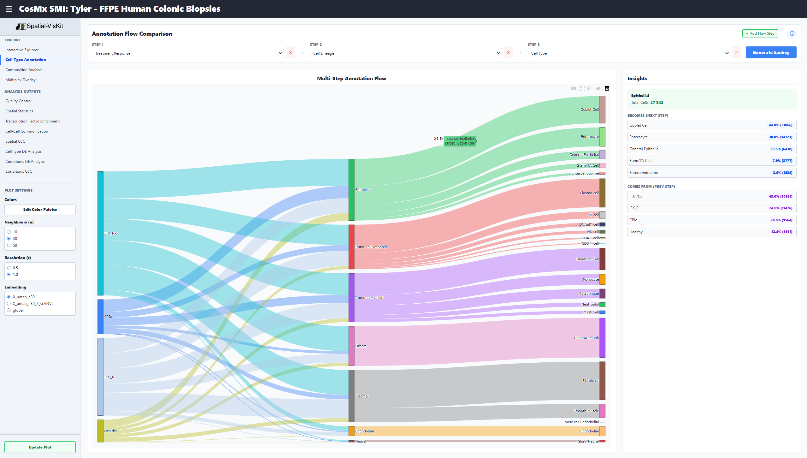
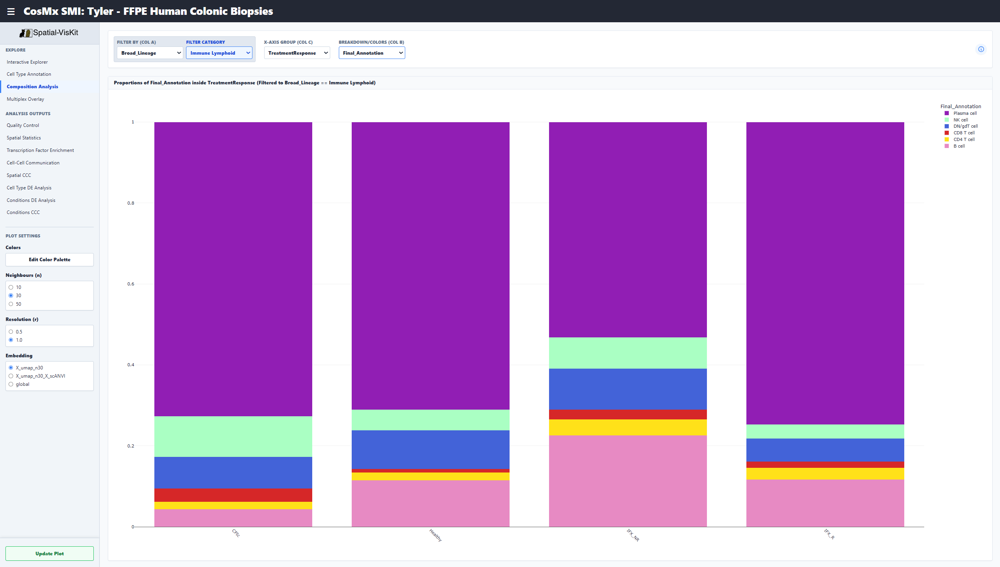
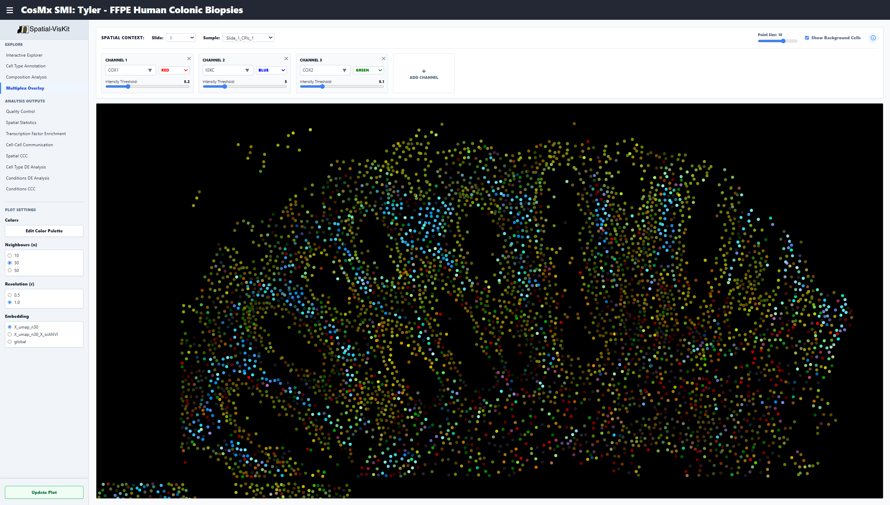
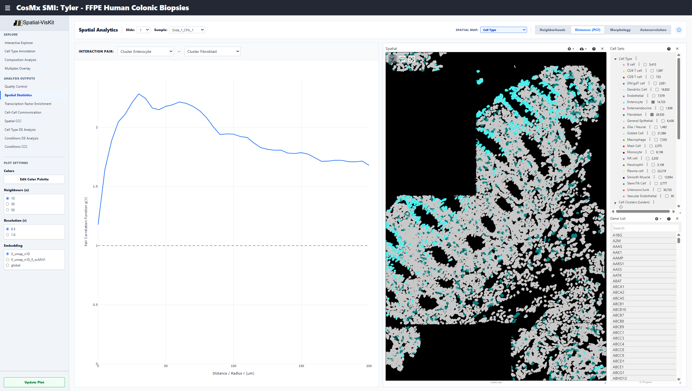
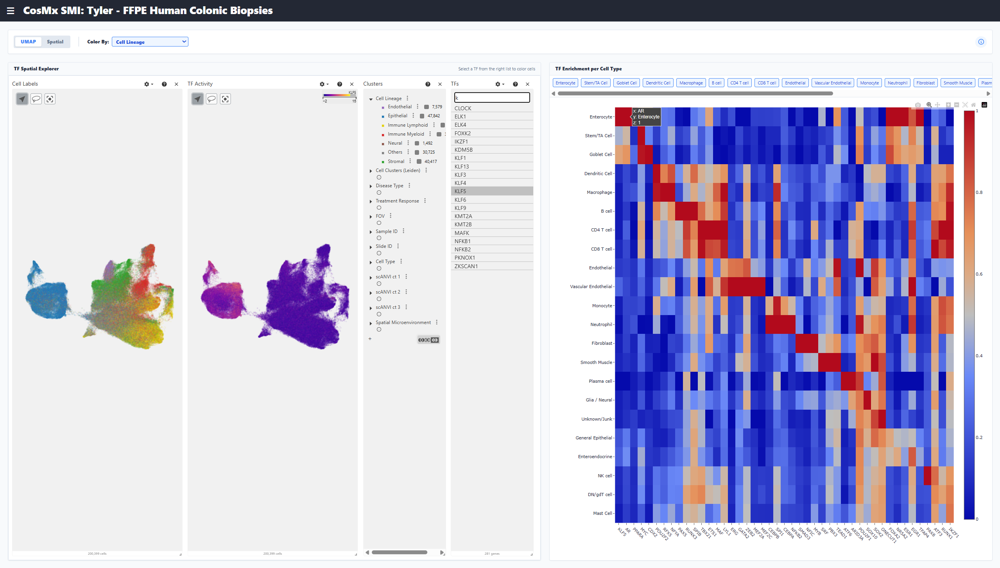
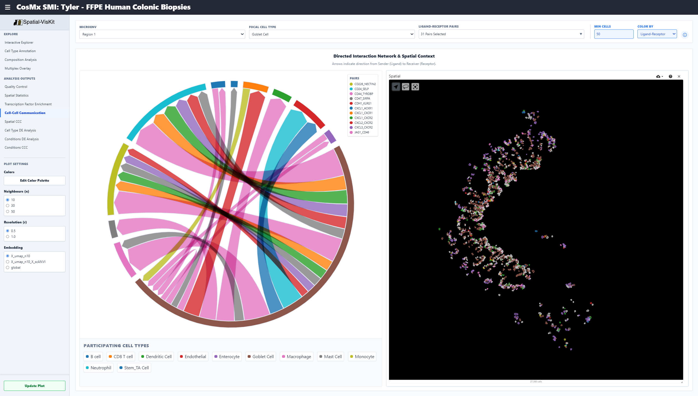
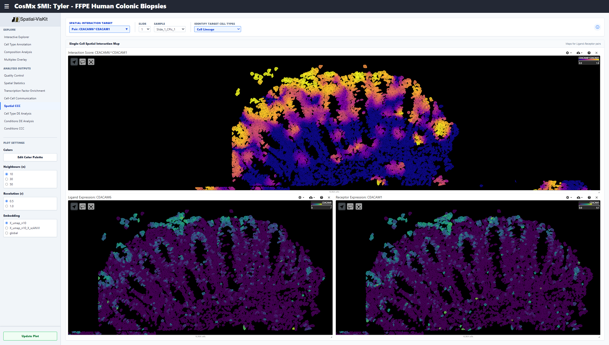
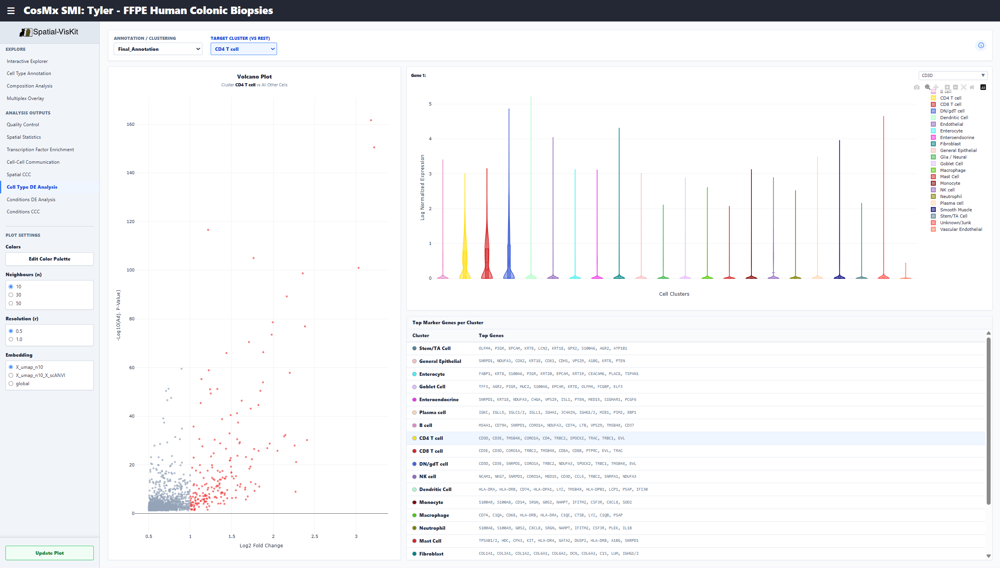
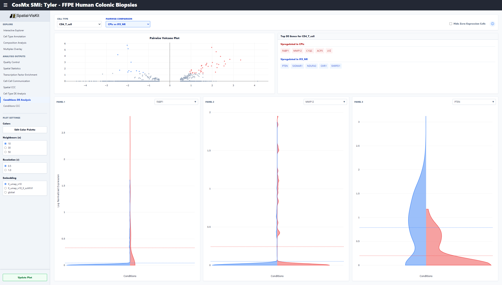

# Spatial-VisKit


An interactive, web-based visualization tool for exploring spatial transcriptomics (ST)datasets. Built to explore ST analysis results from **[this Xenium & CosMx pipeline](https://github.com/kitku15/scST-pipeline/)**.

Spatial-VisKit allows researchers to visually explore tissue maps, UMAPs, cell-cell communication, transcription factor activity, and clustering directly in their web browser.


## 🛠️ Prerequisites

1. Download and install **[Docker Desktop](https://www.docker.com/products/docker-desktop/)**.
2. Make sure Docker Desktop is open and running in the background before proceeding.

## ⚙️ Set Up

### Step 1: Prepare Your Data

Place your dataset folder into the `public/` directory of this app.

1. Locate your dataset folder. This might be an output from the main pipeline (e.g., `my_data`) or your own dataset in zarr format.
2. Copy that entire folder into the `public/` folder of Spatial-VisKit.
3. Your folder structure should look like this:
   ```text
   Spatial-VisKit/
   ├── public/
   │   ├── my_data/
   │   │   ├── dataset_config.json
   │   │   ├── my_data.zarr
   │   │   ├── my_data_tf.zarr
   │   │   └── aux_data
   ├── .env
   ├── docker-compose.yml
   └── ...
   ```
   The `my_data_tf.zarr` and `aux_data` is included inside the output folder from the main pipeline. If using your own dataset, this is not needed.

### Step 2: Configure the App

There are **two** configuration files:

1. **`.env`**: Tells the app which dataset folder to load and what mode to run in.
2. **`dataset_config.json`**: placed inside your dataset folder and tells the app how to read your specific dataset. Use this exact file name.

#### A. `.env`

Open the file named `.env` (located in the main Spatial-VisKit folder) using any basic text editor (Notepad, VS Code.). Update the values to match the dataset you want to view.

```env
# 1. The exact name of your dataset folder inside the /public directory
ACTIVE_DATASET_FOLDER=my_data

# 2. What mode is the app in?
# "full" = Pipeline Output (Includes spatial stats, cell-cell comm, TF analysis)
# "lite" = Use-Your-Own-Data (Basic spatial, UMAP, and expression viewing)
VITE_APP_MODE=full

# 3. A title to be displayed in the app
VITE_PROJECT_TITLE="CosMx SMI: My Data XYZ"

# 4. Do not change this
VITE_API_BASE_URL=http://localhost:8000
```

#### B. `dataset_config.json`

Inside your specific dataset folder (e.g., `public/my_data/`), there must be a file named `dataset_config.json`. This tells the visualizer what columns and arrays to map.

<details>
<summary><b>Click to view example for "FULL" Mode (HPC Pipeline Output)</b></summary>

**When to use:** Use this mode if your dataset was processed by the main pipeline and includes advanced data like Transcription Factors, Spatial Stats, and Cell-Cell Communication files.

```json
{
  "zarr_filename": "my_data_web.zarr", # name of my zarr folder
  "tf_zarr_filename": "my_data_tf_web.zarr", # name of my zarr tf folder
  "spatial_key": "global", # key in obsm for spatial coordinates
  "slide_col": "slide_ID", # obs collumn for slide id
  "sample_col": "sample_id", # obs collumn for sample id
  "primary_annotation": "Final_Annotation", # cell type labels used for downstream analysis
  "dynamic_annotations": # leiden cell type clusters (change depending on n and r)
  [
    {"name": "Cell Clusters (Leiden)", "prefix": "leiden" }
  ],
  "extra_obs_sets": # additional categorical columns in "my_data_web.zarr" obs
  [
    { "name": "Disease Type", "path": "obs/DiseaseType" },
    { "name": "Treatment Response", "path": "obs/TreatmentResponse" },
    { "name": "FOV", "path": "obs/fov" },
    { "name": "Cell Lineage", "path": "obs/Broad_Lineage" },
    { "name": "Cell Type", "path": "obs/Final_Annotation" }
  ]
}
```

</details>

<details>
<summary><b>Click to view example for "LITE" Mode (Bring-Your-Own-Data)</b></summary>

**When to use:** Use this mode if you only have a `.zarr` file and want to explore Spatial plots, UMAPs, and basic gene expression mapping.

```json
{
  "zarr_filename": "my_data.zarr", # name of my zarr folder
  "spatial_key": "global", # key in obsm for spatial coordinates
  "slide_col": "slide_id", # obs collumn for slide id
  "sample_col": "slide_id", # obs collumn for sample id
  "primary_annotation": "leiden_n30_r1.0", # ???

  "available_embeddings": # embeddings in your dataset in "my_data_web.zarr" obsm
  [
    { "name": "UMAP", "path": "obsm/X_umap" },
    { "name": "PCA", "path": "obsm/X_pca" }
  ],

  "dynamic_annotations": [], # leave blank???

  "extra_obs_sets": # additional categorical columns in "my_data_web.zarr" obs
  [
    { "name": "Disease Type", "path": "obs/DiseaseType" },
    { "name": "Cell Type", "path": "obs/CellType" }
  ]
}
```

</details>

---

### Step 3: Run the Application

Once your data is in the `public/` folder and your `.env` file is saved:

1. Open your computer's Terminal (Mac) or Command Prompt/PowerShell (Windows).
2. Navigate to the main Spatial-VisKit folder.
3. Run the following command:
   ```bash
   docker-compose up --build
   ```
4. Wait for the setup to finish. It will download the necessary containers and launch the tool.
5. Open your web browser and go to: **`http://localhost:5173`**

### To Stop the Application:

Go back to your terminal window where Docker is running and press `Ctrl + C`.

**⚠️ Important:** If you ever change the `ACTIVE_DATASET_FOLDER` in your `.env` file, you **must** stop the application (`Ctrl + C`) and restart it by typing `docker-compose up --build` again.

## 🎨 Features

The app has 12 tabs: 4 for data exploration in both Lite and Full mode, and 8 for exploring the main HPC pipeline outputs.

### Explore

<details>
<summary>Interactive Explorer</summary>

The main tab for exploring your dataset.

- **Side-by-Side Views:** Explore the physical spatial distribution of your tissue alongside the UMAP/PCA embeddings.
- **Dynamic Coloring:** Color cells by clusters, cell type annotations, or any other metadata.
- **Gene Expression:** Search for any gene in the dataset to visualize expression on spatial coordinates and UMAP (based on values in adata.X)
- **Label Composition:** Click any slice in the bottom-right composition pie chart to isolate and highlight only that specific cell type in the spatial and UMAP maps. The pie chart shows the compositions of each label based on which slide/sample is selected.
- **Lasso Tool:** Select cells in either the spatial plot or embedding, with the selected cells highlighted simultaneously in both views.
</details>

<details>
<summary>Cell Type Annotation</summary>


Track how cells are classified across different algorithms or clustering resolutions.

- **Sankey Diagram:** Build a multi-step flow diagram to compare how cells map between different metadata columns (e.g., _Slide ID_ → _Cell Lineage_ → _Cell Type_).
- **Hover Insights:** Hover over any cluster block or connection to view exact cell counts and percentages, showing how cells are distributed across the different annotations.
</details>

<details>
<summary>Composition Analysis</summary>


Quantify tissue heterogeneity across different samples or conditions.

- **Custom Stacked Bar Charts:** Dynamically build bar charts showing the proportions of cell types or metadata. All bars are normalized to 100%.
- **Grouping:** Choose your X-Axis (e.g., compare across _Sample ID_ or _Disease Type_) and your Breakdown category (e.g., _Cell Type_).
- **Filtering:** Optionally restrict the analysis to a specific subset of cells (e.g., only analyze the composition of "Immune" cells).
</details>

<details>
<summary>Multiplex Overlay</summary>


Visualize the spatial overlap of up to 5 genes simultaneously.

- **Additive RGB Blending:** Assign different colors (Red, Green, Blue, Magenta, Cyan, Yellow) to specific genes. Overlapping expressions will blend (e.g., Red + Green = Yellow).
- **Intensity Thresholds:** Use sliders to filter out low-expression background noise and isolate stronger signals.
</details>

<br/>

### Analysis Outputs

<details>
<summary>Quality Control</summary>

Inspect the pre-filter quality metrics of the dataset.

- **Histograms:** View the raw distributions of total transcripts, unique genes, cell area, and nucleus signal.
- **Thresholds:** Red dashed lines indicate cutoff thresholds applied during the pipeline.
</details>

<details>
<summary>Spatial Statistics</summary>


Explore the physical organization of the tissue through four sections, synchronized with a spatial map. All results are per sample.

- **Neighborhoods:** Cell Type Neighbourhood Enrichment (SquidPy).
- **Distances (PCF):** Pair Correlation Function graph (MuSpan).
- **Morphology:** Violin plots comparing physical cell properties (MuSpan).
- **Autocorrelation:** Network Centrality and Moran's I statistics (SquidPy).
</details>

<details>
<summary>Transcription Factor Enrichment</summary>


Visualize results from DecoupleR.

- **Enrichment Heatmap:** A clustered heatmap displaying Z-scaled Transcription Factor (TF) activity scores per cell type.
- **Spatial/UMAP Explorer:** Select a specific TF to map its predicted activity score onto the cells in tissue space and UMAP space.
</details>

<details>
<summary>Cell-Cell Communication (Cellphonedb)</summary>


Visualize results from Cellphonedb. Map microenvironment-level signaling between different cell populations.

- **Chord Diagram:** Visualizes directed ligand-receptor interactions. Thick ribbon bases indicate the Sender (Ligand), pointing toward the Receiver (Receptor).
- **Deep Filtering:** Isolate interactions happening strictly within a specific spatial microenvironment, involving a specific focal cell type, or limited to specific Ligand-Receptor pairs.
</details>

<details>
<summary>Spatial CCC (LIANA)</summary>


Visualize results from LIANA+ ligand-receptor colocalization analysis. Visualize cell-cell communication at single-cell, spatial resolution.

- **Interaction Mapping:** Select a specific Ligand-Receptor pair or NMF Communication Factor to see its exact spatial footprint on the tissue.
- **Split Views:** Simultaneously view the combined interaction score alongside the isolated expression of the Sender's Ligand and the Receiver's Receptor.
</details>

<details>
<summary>Cell Type DE Analysis</summary>


Identify marker genes defining specific cell clusters.

- **Volcano Plot:** Visualizes statistical significance vs. fold change for a target cluster compared to all other cells.
- **Marker Tables:** Quickly view the top defining genes for every cluster in the dataset.
- **Violin Plots:** Search for a specific gene to see its expression distribution across all clusters side-by-side.
</details>

<details>
<summary>Conditions DE Analysis</summary>


Visualize PyDEseq2 results on pairwise comparisons (e.g., Healthy vs. Disease) _within_ a specific cell type.

- **Condition Volcano Plot:** Instantly see the top upregulated and downregulated genes between the two selected conditions.
- **Split Violins:** Search for up to 3 specific genes to compare their distributions side-by-side across the two conditions.
- **Zero-Filtering:** Easily toggle hiding cells with 0 expression to compare transcriptomic shifts only in actively expressing cells.
</details>

<details>
<summary>Condition Signaling (Causal)</summary>

Visuazlize results from LIANA+ and Corneto. Map how external signals trigger intracellular protein cascades to regulate gene expression under specific conditions.

- **Condition-Altered Signals:** Displays Ligand-Receptor pairs that are significantly up-regulated or down-regulated between conditions.
- **Altered TF Activity:** Highlights which Transcription Factors are statistically shifted in the Receiver Cell.
- **Causal Network:** An interactive, D3 force-directed graph mapping the biological pathways linking the active Receptors through intermediate Kinases to the Transcription Factors.
</details>

## ⭐ Author

This application was developed as a part of a project for the MRes in Bioinformatics and Theoretical Systems Biology at Imperial College London. The work was supervised by Tamas Korcsmaros and Balazs Bohar.

- 😸 Author: Bunga Tiasyaira Hutasuhut (Syaii)
- 📩 Academic Email: bth22@ic.ac.uk
- 📮 Personal Email: bungatiasyaira@outlook.com
