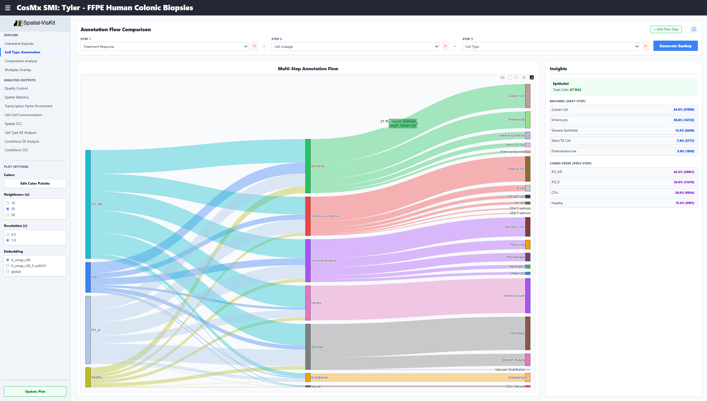
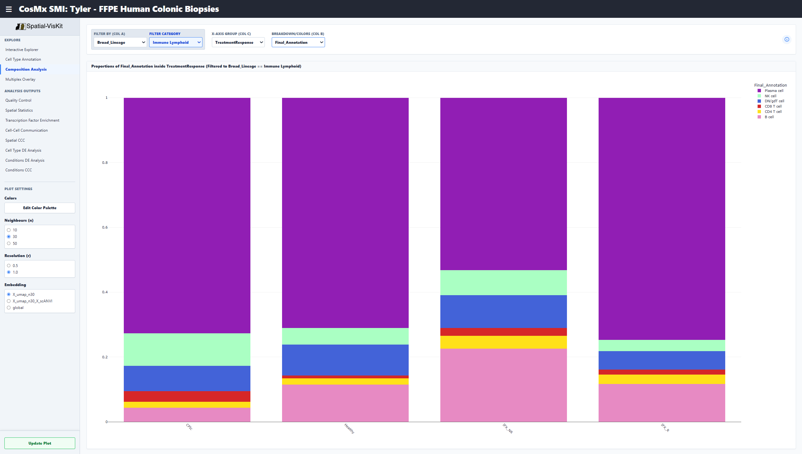
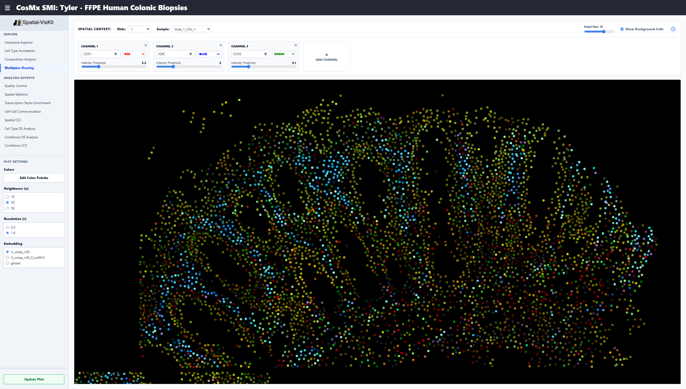
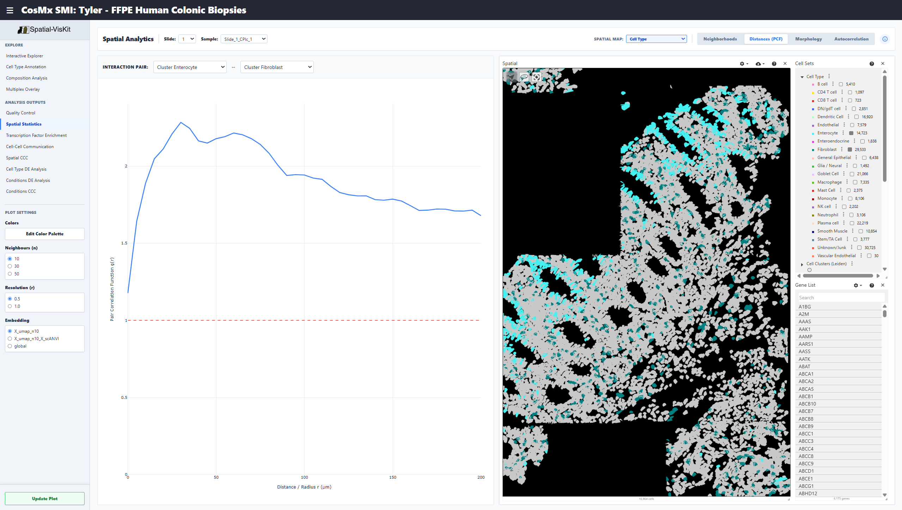
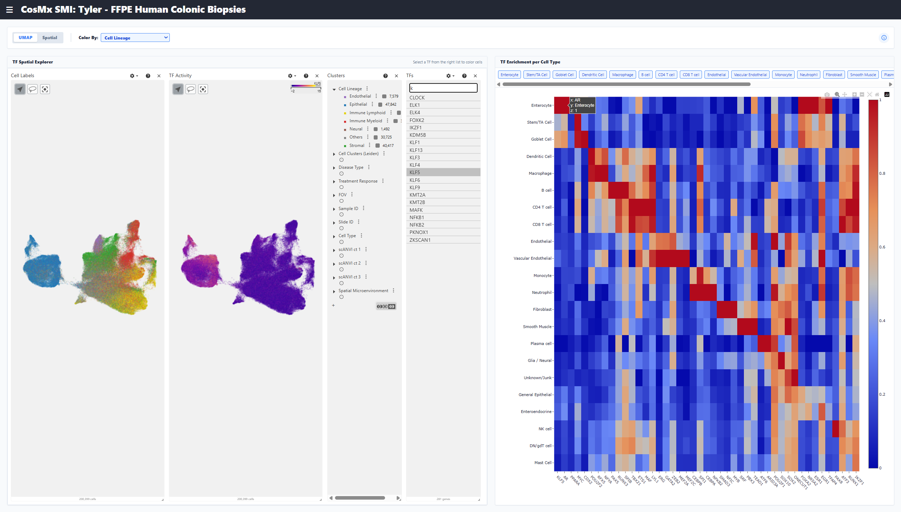
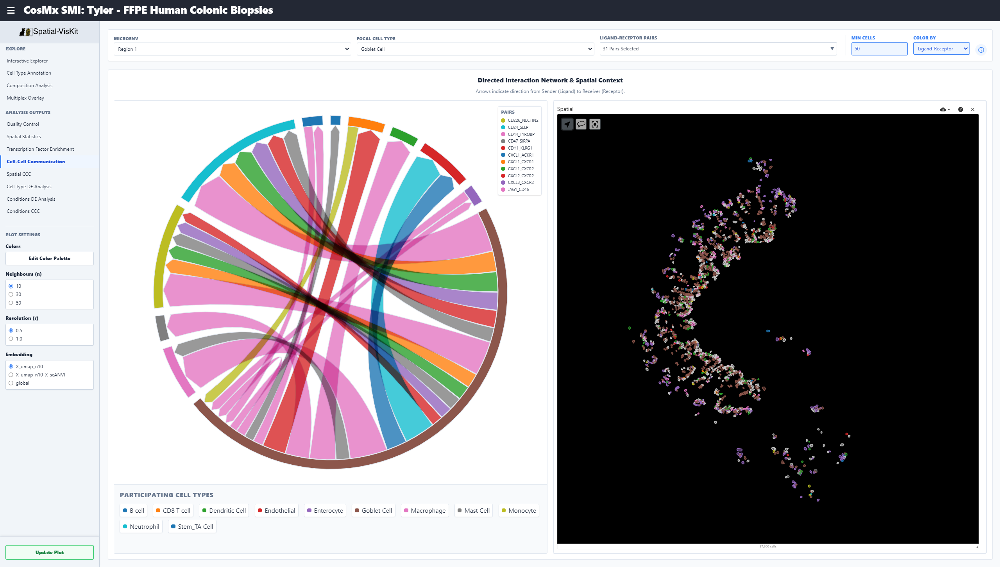
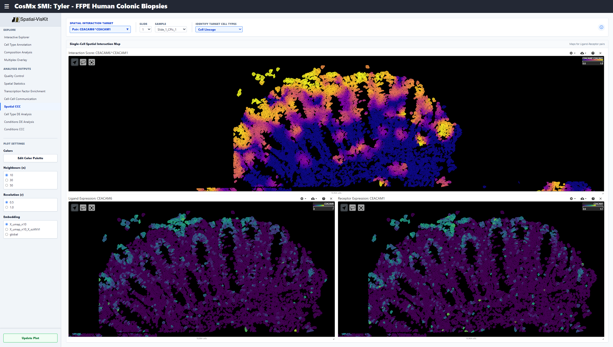
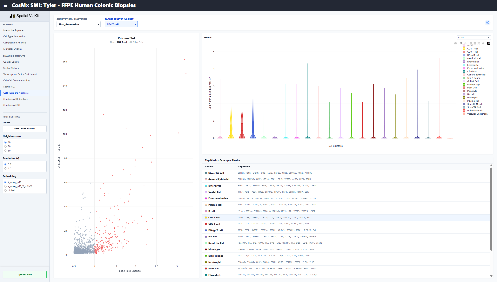
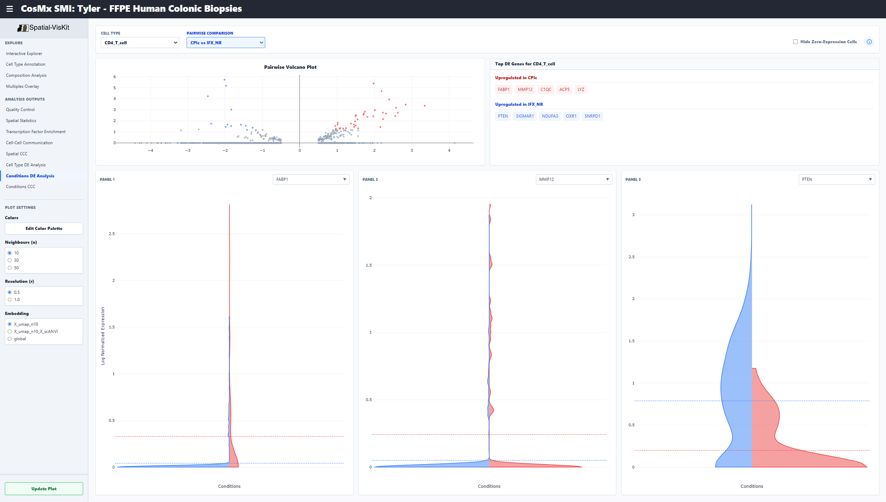

# Spatial-VisKit

An interactive, web-based visualization tool for exploring single cell spatial transcriptomics (ST) datasets. Built to explore ST analysis results from the **[scSpatial-Kit pipeline](https://github.com/kitku15/scST-pipeline/)**, while also allowing users to load and explore their own ST analysis results.

Spatial-VisKit allows users to explore tissue maps, UMAPs, cell-cell communication, transcription factor activity, and clustering directly in their web browser. Users can also download filtered data and export plots and spatial tissue maps. More features are planned for future releases!

- [Read the documentation on the pipeline (**scSpatial-Kit**)](https://kitku15.github.io/scST-pipeline/)

- [Read the documentation on the visualization tool (**Spatial-VisKit**)](https://kitku15.github.io/scST-pipeline/svk/home/)

## 🎨 Features

### Explore

Interactive Explorer

The main tab for exploring your dataset.

- **Side-by-Side Views:** Explore the physical spatial distribution of your tissue alongside the UMAP/PCA embeddings.
- **Dynamic Coloring:** Color cells by clusters, cell type annotations, or any other metadata.
- **Gene Expression:** Search for any gene in the dataset to visualize expression on spatial coordinates and UMAP (based on values in adata.X)
- **Label Composition:** Click any slice in the bottom-right composition pie chart to isolate and highlight only that specific cell type in the spatial and UMAP maps. The pie chart shows the compositions of each label based on which slide/sample is selected.
- **Lasso Tool:** Select cells in either the spatial plot or embedding, with the selected cells highlighted simultaneously in both views.
- **Download Tissue/UMAP plots:** Customize the tissue map or UMAP view, including the background, and download the current view as a PNG image.

Cell Type Annotation

Track how cells are classified across different algorithms or clustering resolutions.

- **Sankey Diagram:** Build a multi-step flow diagram to compare how cells map between different metadata columns (e.g., _Slide ID_ → _Cell Lineage_ → _Cell Type_).
- **Hover Insights:** Hover over any cluster block or connection to view exact cell counts and percentages, showing how cells are distributed across the different annotations.

Composition Analysis

Quantify tissue heterogeneity across different samples or conditions.

- **Custom Stacked Bar Charts:** Dynamically build bar charts showing the proportions of cell types or metadata. All bars are normalized to 100%.
- **Grouping:** Choose your X-Axis (e.g., compare across _Sample ID_ or _Disease Type_) and your Breakdown category (e.g., _Cell Type_).
- **Filtering:** Optionally restrict the analysis to a specific subset of cells (e.g., only analyze the composition of "Immune" cells).

Multiplex Overlay

Visualize the spatial overlap of up to 5 genes simultaneously.

- **Additive RGB Blending:** Assign different colors (Red, Green, Blue, Magenta, Cyan, Yellow) to specific genes. Overlapping expressions will blend (e.g., Red + Green = Yellow).
- **Intensity Thresholds:** Use sliders to filter out low-expression background noise and isolate stronger signals.

Data Export

Export your selected cells and metadata as a CSV file for further analysis in Excel or other tools.

- **Select cells:** Use the lasso tool to select cells directly on the UMAP or tissue map.
- **Filter cells:** Filter by specific metadata categories, such as cell type or disease condition.
- **Select metadata:** Include some, all, or none of the available metadata columns.
- **Include gene expression:** Add expression values for any number of selected genes, or omit gene expression entirely.

 

### Analysis Outputs

Quality Control

Inspect the pre-filter quality metrics of the dataset.

- **Histograms:** View the raw distributions of total transcripts, unique genes, cell area, and nucleus signal.
- **Thresholds:** Red dashed lines indicate cutoff thresholds applied during the pipeline.

Spatial Statistics

Explore the physical organization of the tissue through four sections, synchronized with a spatial map. All results are per sample.

- **Neighborhoods:** Cell Type Neighbourhood Enrichment (SquidPy).
- **Distances (PCF):** Pair Correlation Function graph (MuSpan).
- **Morphology:** Violin plots comparing physical cell properties (MuSpan).
- **Autocorrelation:** Network Centrality and Moran's I statistics (SquidPy).

Transcription Factor Enrichment

Visualize results from DecoupleR.

- **Enrichment Heatmap:** A clustered heatmap displaying Z-scaled Transcription Factor (TF) activity scores per cell type.
- **Spatial/UMAP Explorer:** Select a specific TF to map its predicted activity score onto the cells in tissue space and UMAP space.

Cell-Cell Communication (Cellphonedb)

Visualize results from Cellphonedb. Map microenvironment-level signaling between different cell populations.

- **Chord Diagram:** Visualizes directed ligand-receptor interactions. Thick ribbon bases indicate the Sender (Ligand), pointing toward the Receiver (Receptor). This plot can be downloaded as an svg.
- **Deep Filtering:** Isolate interactions happening strictly within a specific spatial microenvironment, involving a specific focal cell type, or limited to specific Ligand-Receptor pairs.

Spatial CCC (LIANA)

Visualize results from LIANA+ ligand-receptor colocalization analysis. Visualize cell-cell communication at single-cell, spatial resolution.

- **Interaction Mapping:** Select a specific Ligand-Receptor pair or NMF Communication Factor to see its exact spatial footprint on the tissue.
- **Split Views:** Simultaneously view the combined interaction score alongside the isolated expression of the Sender's Ligand and the Receiver's Receptor.
- **Download Tissueplots:** Customize the tissue map view, including the background, and download the current view as a PNG image.

Cell Type DE Analysis

Identify marker genes defining specific cell clusters.

- **Volcano Plot:** Visualizes statistical significance vs. fold change for a target cluster compared to all other cells.
- **Marker Tables:** Quickly view the top defining genes for every cluster in the dataset.
- **Violin Plots:** Search for a specific gene to see its expression distribution across all clusters side-by-side.

Conditions DE Analysis

Visualize PyDEseq2 results on pairwise comparisons (e.g., Healthy vs. Disease) _within_ a specific cell type.

- **Condition Volcano Plot:** Instantly see the top upregulated and downregulated genes between the two selected conditions.
- **Split Violins:** Search for up to 3 specific genes to compare their distributions side-by-side across the two conditions.
- **Zero-Filtering:** Easily toggle hiding cells with 0 expression to compare transcriptomic shifts only in actively expressing cells.

Condition Signaling (Causal)

Visuazlize results from LIANA+ and Corneto. Map how external signals trigger intracellular protein cascades to regulate gene expression under specific conditions.

- **Condition-Altered Signals:** Displays Ligand-Receptor pairs that are significantly up-regulated or down-regulated between conditions.
- **Altered TF Activity:** Highlights which Transcription Factors are statistically shifted in the Receiver Cell.
- **Causal Network:** An interactive, D3 force-directed graph mapping the biological pathways linking the active Receptors through intermediate Kinases to the Transcription Factors.

## ⭐ Author

This application was developed as a part of a project for the MRes in Bioinformatics and Theoretical Systems Biology at Imperial College London. The work was supervised by Dr Tamas Korcsmaros and Dr Balazs Bohar.

- 😸 Author: Bunga Tiasyaira Hutasuhut (Syaii)
- 📮 Email: akbarah97@gmail.com
